# The problem with texts in the browser

Layouting is a bit different compared to normal divs or buttons.

In the browser, texts have some extra space at the top and bottom. The larger the line-height, the larger that extra space.

This creates a problem. Let's say you have a text and below that a button. The designer says: "Please make the space between the text and the button exactly 32px". You now add a bottom margin of 32px to the text. The designers sees the result and says: "That's not 32px it's larger than that." And he's right, because the text element has some extra space at the bottom.

Capsize fixes this problem. It removes the extra space at the top and bottom of the text. Now you can layout texts like any other element.

In the image below, you can see that with capsize, the space between the text and the button is exactly 32px.

That what capsize does. It removes the extra space at the top and bottom of the text. So you can layout texts like any other element.

### Using the [capsize website](https://seek-oss.github.io/capsize/)

First, select the font you want to use.

In step 2. you see two sliders: Cap Height and Line Gap.

- Click on Cap Height and select Font Size
- Click on Line Gap and select Leading

Now, set enter your desired font size.

For the Leading value, multiply your font size by your line-height value.

> Example: 16px \* 1.5 = 24px

In the last step, copy the CSS code and paste it into your project.

## Trimming text for Designers

Figma already supports trimming text. You can use the "Vertical Trim" option.

In this [video tutorial](https://youtu.be/By6ri7vEwuk), you see how to use it.

## Resources

- [capsize](https://github.com/seek-oss/capsize)
- [Capsize website](https://seek-oss.github.io/capsize/)
- [How to trim text in Figma](https://youtu.be/By6ri7vEwuk)
- [Leading-Trim: The Future of Digital Typesetting](https://medium.com/microsoft-design/leading-trim-the-future-of-digital-typesetting-d082d84b202)
- [capsize w/ fluid type](https://github.com/asyarb/capsize-fluid?tab=readme-ov-file)
- [Example of using capsize](https://stackblitz.com/edit/vitejs-vite-xq4fzrh6?file=src%2Fmain.ts)
